# Laporan Proyek Machine Learning - Jasmine Kinasih

## Domain Proyek
Domain yang dipilih untuk proyek _machine learning_ ini adalah Bisnis Properti, dengan judul Predictive Analytics: Harga Rumah


### Latar Belakang
Pasar properti merupakan sektor investasi global dan lokal yang signifikan, dengan dinamika kompleks di kota-kota besar yang menimbulkan fluktuasi harga. Tantangan utama bagi investor adalah mengidentifikasi properti undervalued, bagi agen properti menentukan harga kompetitif, dan bagi pembeli memahami nilai pasar. Penelitian sebelumnya [[1]](https://jurnal.unidha.ac.id/index.php/jteksis/article/view/1732/953) memperkuat pendekatan ini dengan implementasi algoritma Regresi Linier untuk prediksi harga rumah di Amerika Serikat, yang mengidentifikasi bahwa fitur-fitur seperti kualitas rumah keseluruhan dan luas ruang hidup memiliki korelasi signifikan dengan harga rumah.

Kebutuhan akan tempat tinggal menjadi prioritas bagi berbagai kalangan masyarakat, namun dengan pertumbuhan penduduk yang terus meningkat, tidak semua golongan mampu memiliki tempat tinggal yang layak huni. Penelitian [[2]](https://journal.isas.or.id/index.php/JACOST/article/view/491/202) menunjukkan bahwa penggunaan algoritma machine learning dapat membantu memberikan informasi prediksi harga rumah yang akurat, dengan hasil yang menunjukkan Random Forest Regression mencapai akurasi tertinggi 81,5% (RMSE 0,440) dibandingkan Linear Regression (RMSE 0,515) dan Gradient Boosted Trees Regression (RMSE 0,508), memberikan landasan kuat untuk pendekatan yang serupa dalam proyek ini.


## Business Understanding
### Problem Statements
-  Bagaimana cara memprediksi harga rumah berdasarkan karakteristik fisik dan lokasi properti?
- Faktor-faktor apa yang paling berpengaruh terhadap harga rumah di pasar properti?
- Bagaimana meningkatkan akurasi prediksi harga rumah dengan pendekatan machine learning yang tepat?

### Goals

- Mengembangkan model prediktif untuk memperkirakan harga rumah berdasarkan fitur
- Melakukan analisis feature importance untuk mengetahui variabel apa saja yang paling memengaruhi harga rumah.
- Membandingkan performa beberapa algoritma regresi seperti Linear Regression, Random Forest, dan Gradient Boosting untuk mendapatkan model terbaik.

### Solution statement

- Pembangunan Model Regresi
Mengembangkan model Linear Regression sebagai baseline, lalu membandingkannya dengan Random Forest dan Gradient Boosting untuk menangkap hubungan non-linear. Evaluasi dilakukan menggunakan MSE, RMSE, dan R².

- Pemilihan dan Optimasi Model Terbaik
Model dengan performa terbaik dioptimalkan menggunakan GridSearchCV atau RandomizedSearchCV untuk meningkatkan akurasi prediksi.


## Data Understanding
Exploratory data analysis atau sering disingkat EDA merupakan proses investigasi awal pada data untuk menganalisis karakteristik, menemukan pola, anomali, dan memeriksa asumsi pada data. Teknik ini biasanya menggunakan bantuan statistik dan representasi grafis atau visualisasi.

### Deskripsi Variabel

**Informasi Dataset**
| Jenis  | Keterangan |
| ----- | --- |
| Title   | USA House Prices  |
| Source | [Kaggle](https://www.kaggle.com/datasets/fratzcan/usa-house-prices/data)  |
| Visibility | Publik |

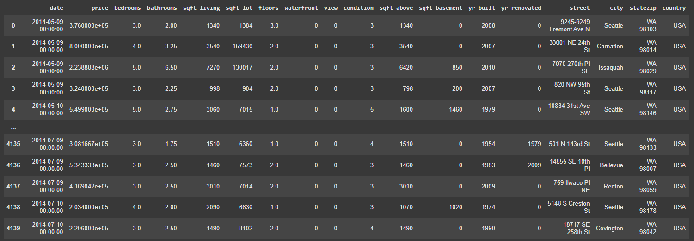

Dilihat dari gambar beberapa fitur di dataset ini sudah diubah ke kategori numerik seperti view, condition, dan waterfront terlebih dahulu oleh pembuat. Dataset memiliki 4140 sample dengan 18 fitur.

**Variabel-variabel pada Dataset Harga Rumah adalah sebagai berikut:**
* `date`: Tanggal transaksi penjualan rumah. Formatnya mungkin berupa string dan perlu diolah menjadi format tanggal yang sesuai.
* `price`: Harga penjualan rumah. Ini adalah variabel target yang ingin diprediksi. Tipe datanya adalah numerik (float atau integer).
* `bedrooms`: Jumlah kamar tidur dalam rumah. Tipe datanya adalah numerik (float atau integer).
* `bathrooms`: Jumlah kamar mandi dalam rumah. Tipe datanya adalah numerik (float atau integer), seringkali mencakup nilai pecahan (misalnya, 1.5 untuk satu kamar mandi penuh dan satu toilet).
* `sqft_living`: Luas area tempat tinggal dalam satuan kaki persegi. Tipe datanya adalah numerik (integer).
* `sqft_lot`: Luas lahan properti dalam satuan kaki persegi. Tipe datanya adalah numerik (integer).
* `floors`: Jumlah lantai dalam rumah. Tipe datanya adalah numerik (float atau integer).
* `waterfront`: Indikator apakah rumah memiliki pemandangan atau akses ke tepi pantai (biasanya berupa nilai biner 0 atau 1). Tipe datanya adalah numerik (integer).
* `view`: Indeks kualitas pemandangan properti (biasanya skala numerik, misalnya dari 0 hingga 4 atau 5, dengan nilai yang lebih tinggi menunjukkan pemandangan yang lebih baik). Tipe datanya adalah numerik (integer).
* `condition`: Kondisi keseluruhan rumah (biasanya skala numerik, misalnya dari 1 hingga 5, dengan nilai yang lebih tinggi menunjukkan kondisi yang lebih baik). Tipe datanya adalah numerik (integer).
* `sqft_above`: Luas area rumah yang berada di atas permukaan tanah (tidak termasuk basement) dalam satuan kaki persegi. Tipe datanya adalah numerik (integer).
* `sqft_basement`: Luas area basement rumah dalam satuan kaki persegi (bisa bernilai 0 jika tidak ada basement). Tipe datanya adalah numerik (integer).
* `yr_built`: Tahun rumah dibangun. Tipe datanya adalah numerik (integer).
* `yr_renovated`: Tahun terakhir rumah direnovasi (bisa bernilai 0 jika tidak pernah direnovasi). Tipe datanya adalah numerik (integer).
* `street`: Alamat jalan properti (berupa string).
* `city`: Nama kota properti (berupa string).
* `statezip`: Kombinasi kode negara bagian dan kode pos (berupa string).
* `country`: Nama negara properti (berupa string).

### Pre processing Data
1. Missing Value
Missing Value adalah hilangnya beberapa data yang telah diperoleh. Pada dataset ini, tidak ditemukan missing value, sehingga tidak diperlukan tindakan seperti imputasi atau penghapusan baris data.

2. Duplicate Data
Duplicate Data adalah kondisi dimana satu atribut memiliki dua atau lebih nilai yang sama. Pada dataset ini, tidak ditemukan duplikat data.

3. Outlier
Outlier dapat dianggap sebagai bagian data yang sangat rendah atau tinggi, jauh dari rata-rata atau norma dari kumpulan data. Deteksi outlier penting untuk menghindari pengaruh yang berlebihan terhadap model. Berdasarkan pemeriksaan visual (seperti menggunakan boxplot) dan analisis statistik ditemukan beberapa outlier di tiap fitur numerik. Kemudian dilakukan pembersihan outlier menggunakan metode IQR.

    Berikut ini merupakan rumus perhitungan IQR.

    IQR = Q3 - Q1

    Lower Bound = Q1 − 1.5 × IQR

    Upper Bound = Q3 + 1.5 × IQR

    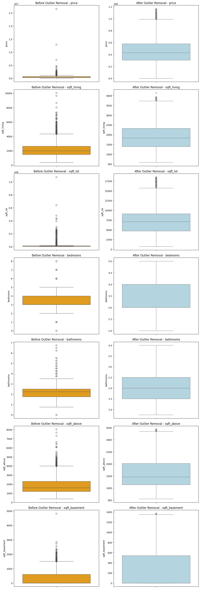


4. Fitur yang berisikan nilai '0'
Berikut ini beberapa fitur yang berisikan nilai 0. Ada beberapa data yang berisikan 0 tapi tidak harus di hapus karena merupakan data kategorial. Berikut ini beberapa fitur yang berisikan nilai '0' :
* `price`  

  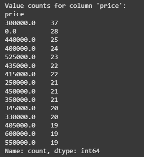

  pada kolom price, terdapat nilai 0 yang berarti harus di hilangkan agar saat pelatihan model bisa memprediksi dengan baik

* `bathrooms`

  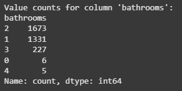

  pada kolom bathrooms, terdapat nilai 0 yang berarti harus di hilangkan agar saat pelatihan model bisa memprediksi dengan baik

* `view`

  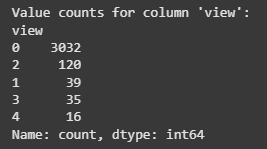

  nilai 0 pada kolom ini termasuk range data. fitur ini bersifat kategorial.

* `waterfront`

  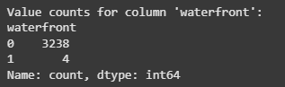

  nilai 0 pada kolom ini termasuk range data. fitur ini bersifat kategorial.

* `yr_renovated`

  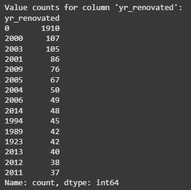

  nilai 0 pada yr_renovated menandakan rumah belum pernah di renovasi, hal ini bisa di lihat range data. bahwa tahun renovasi di mulai di angka 2000 an. 

* `sqft_basement`

  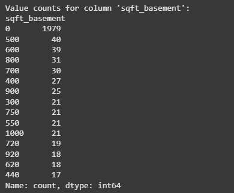

  nilai 0 pada yr_renovated menandakan rumah belum pernah di renovasi, hal ini bisa di lihat range data. bahwa tahun renovasi di mulai di angka 2000 an. 

dari beberapa penjelasan tersebut, fitur yang memiliki nilai 0 hanya fitur price dan bathrooms menggunakan kode di bawah ini 
```
df_clean = df_clean[df_clean['price'] != 0]
df_clean = df_clean[df_clean['bathrooms'] != 0]
```

5. Penghapusan fitur yang tidak terpakai

```
df_clean.drop(['street', 'country'], axis=1, inplace=True)
```

Alasan Penghapusan:

`street`:
- Data ini bersifat unik untuk setiap rumah (misalnya, alamat lengkap).
- Tidak memiliki pola umum atau informasi agregat yang bisa digunakan untuk memprediksi harga rumah.
- Berpotensi menambah noise dan kompleksitas model jika digunakan karena jumlah nilai unik yang sangat banyak.

`country`:

- Kemungkinan hanya berisi satu nilai tetap (misalnya, 'USA') karena data ini berasal dari satu negara saja.
- Fitur dengan nilai konstan tidak memberikan informasi apapun pada proses pelatihan model, sehingga bisa dibuang.

Fitur dihapus karena tidak memberikan kontribusi informasi yang berguna dan hanya menambah kompleksitas dataset.

6. Pengubahan tipe data beberapa fitur

```
df_clean['date'] = pd.to_datetime(df_clean['date'])
df_clean['condition'] = df_clean['condition'].astype(int)
df_clean['waterfront'] = df_clean['waterfront'].astype(int)
df_clean['view'] = df_clean['view'].astype(int)
df_clean['bedrooms'] = df_clean['bedrooms'].astype(int)
df_clean['bathrooms'] = df_clean['bathrooms'].astype(int)
df_clean['floors'] = df_clean['floors'].astype(int)
```
Alasan Pengubahan:

date → datetime:
* Mengubah ke format datetime memungkinkan untuk ekstraksi informasi waktu seperti tahun, bulan, atau hari.
* Ini penting jika ingin menganalisis tren berdasarkan waktu, seperti harga rumah per tahun.

Fitur seperti condition, view, waterfront, bedrooms, bathrooms, floors → integer:
* Nilai-nilai ini secara konseptual adalah angka bulat (jumlah kamar, lantai, skor kondisi, dsb.).
* Terkadang saat pengambilan data, tipe awal bisa berupa float (misal 3.0), padahal secara logis tidak perlu ada angka desimal.
* Mengubah ke int memastikan data lebih rapi dan menghindari kesalahan interpretasi oleh model.

Pengubahan tipe data dilakukan untuk menyesuaikan format data dengan makna aslinya, agar lebih akurat saat digunakan dalam pemodelan atau eksplorasi.

### Univariate Analysis

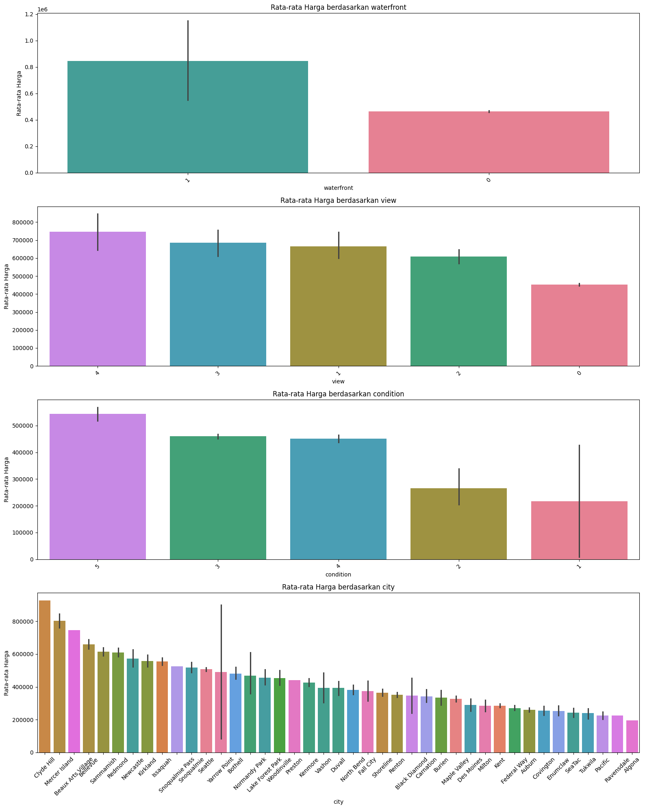

Berdasarkan gambar di atas, dapat dilihat bahwa distribusi data katagorik yang terdiri dari waterfront, view, condition, dan city

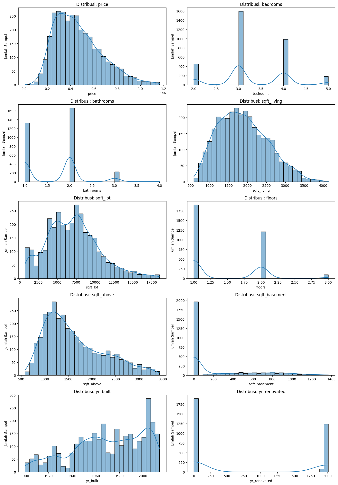

Pada data numerik memiliki karakteristik, yaitu:

**price**

Dilihat dari distribusi harga, sebagian besar properti memiliki harga yang terkonsentrasi antara 0.2 hingga 0.6. Distribusi ini cenderung miring ke kanan (positively skewed), yang mengindikasikan adanya beberapa properti dengan harga yang jauh lebih tinggi daripada mayoritas.

**bedrooms**

Distribusi jumlah kamar tidur menunjukkan beberapa puncak. Puncak tertinggi berada pada sekitar 3 kamar tidur, diikuti oleh puncak yang lebih rendah pada sekitar 4 kamar tidur. Terdapat juga sejumlah properti dengan 2 dan 5 kamar tidur.

**bathrooms**

Distribusi jumlah kamar mandi menunjukkan puncak utama pada sekitar 2 kamar mandi, dan puncak kedua yang lebih rendah pada sekitar 1 kamar mandi. Ini mengindikasikan bahwa sebagian besar properti memiliki antara 1 hingga 3 kamar mandi.

**sqft_living**

Luas ruang tamu (sqft_living) memiliki distribusi yang cenderung miring ke kanan, dengan sebagian besar properti memiliki luas antara 1000 hingga 2500 sqft. Terdapat penurunan jumlah properti seiring dengan bertambahnya luas ruang tamu.

**sqft_lot**

Luas tanah (sqft_lot) menunjukkan distribusi yang sangat miring ke kanan. Sebagian besar properti memiliki luas tanah yang relatif kecil, namun terdapat beberapa properti dengan luas tanah yang sangat besar, yang menyebabkan ekor distribusi memanjang ke kanan.

**floors**

Distribusi jumlah lantai menunjukkan tiga puncak utama, yaitu pada 1 lantai, 2 lantai, dan 3 lantai. Ini mengindikasikan bahwa sebagian besar properti memiliki salah satu dari jumlah lantai tersebut.

**sqft_above**

Luas bangunan di atas tanah (sqft_above) memiliki distribusi yang mirip dengan sqft_living, cenderung miring ke kanan dengan sebagian besar nilai berada di antara 1000 hingga 2500 sqft.

**sqft_basement**

Luas basement (sqft_basement) didominasi oleh nilai 0, yang berarti banyak properti tidak memiliki basement. Untuk properti yang memiliki basement, luasnya bervariasi hingga sekitar 2000 sqft, namun jumlahnya relatif sedikit dibandingkan dengan yang tidak memiliki basement.

**yr_built**

Tahun dibangun (yr_built) menunjukkan distribusi yang memiliki beberapa puncak, terutama di sekitar awal abad ke-20, pertengahan abad ke-20, dan menjelang akhir abad ke-20. Ini mengindikasikan periode-periode pembangunan properti yang signifikan.

**yr_renovated**

Tahun renovasi (yr_renovated) didominasi oleh nilai 0, yang berarti banyak properti tidak pernah direnovasi. Untuk properti yang pernah direnovasi, tahun renovasinya tersebar, namun sebagian besar renovasi terjadi setelah tahun 1950.


### Multivariate Analysis

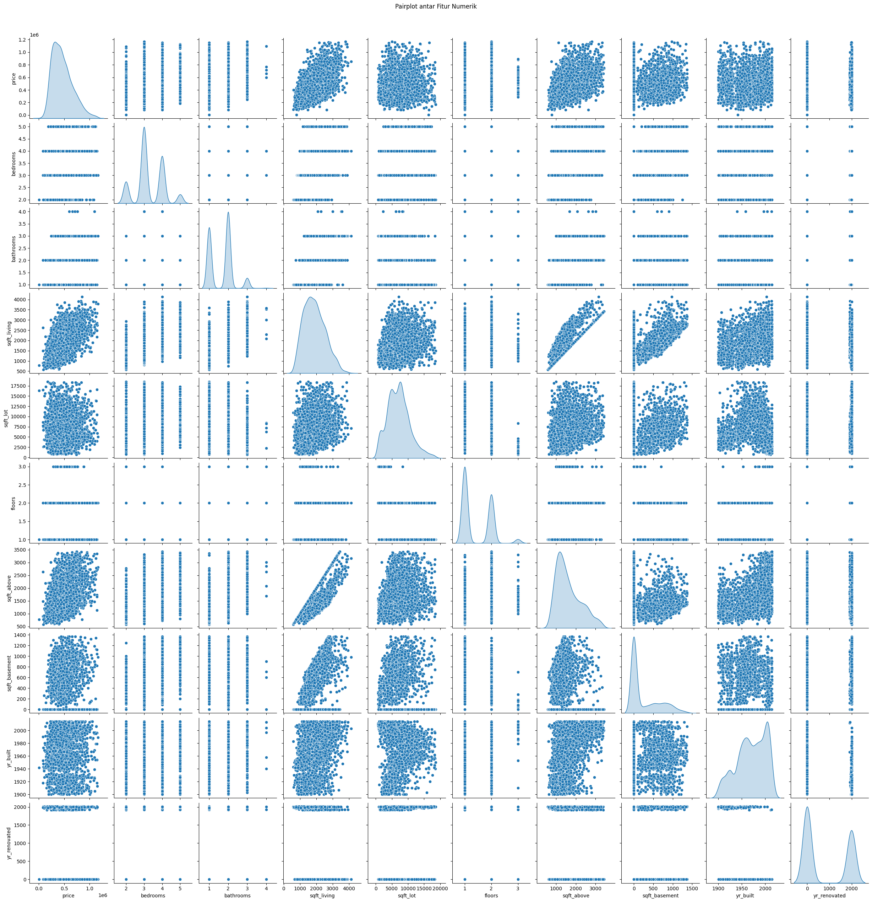

Pairplot adalah visualisasi yang sangat berguna untuk memahami hubungan antara berbagai pasangan variabel numerik dalam sebuah dataset.
* Harga rumah tampaknya sangat dipengaruhi oleh ukuran rumah (sqft_living, sqft_above), jumlah kamar mandi dan tidur, serta kualitas konstruksi (grade).
* Luas tanah (sqft_lot) tampaknya tidak menjadi faktor penentu utama harga.
Variabel seperti tepi laut (waterfront) dan pemandangan (view) kemungkinan besar berkorelasi positif dengan harga, meskipun jumlah datanya mungkin sedikit.
* Tahun dibangun (yr_built) mungkin memiliki pengaruh, tetapi hubungannya mungkin tidak linear dan perlu diselidiki lebih lanjut.
Lokasi kota kemungkinan memainkan peran dalam penentuan harga.

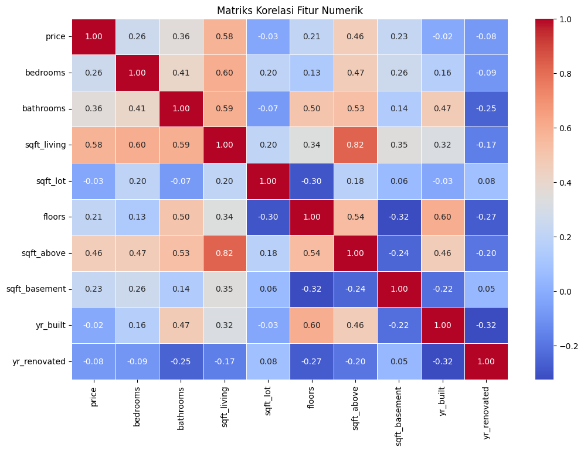
Gambar 3b. Analisis Matriks Korelasi

Matriks korelasi ini menguatkan beberapa observasi awal dari pairplot mengenai hubungan linear antar variabel. Harga rumah memiliki korelasi positif yang signifikan dengan ukuran dan kualitas bangunan (sqft_living, sqft_above), serta jumlah fasilitas (bathrooms). Korelasi dengan luas tanah dan tahun dibangun relatif lemah. Adanya korelasi yang lemah tidak berarti tidak ada hubungan sama sekali, mungkin hubungannya non-linear atau melibatkan interaksi dengan variabel kategorikal seperti waterfront, view, condition, dan city


## Data Preparation
1. Pembuatan Fitur Interaksi

Dibuat fitur baru berupa view_sqft dan waterfront_sqft, yang merupakan hasil perkalian antara fitur view dan sqft_living, serta waterfront dan sqft_living. fitur ini dibuat Untuk menangkap efek interaktif antara lokasi/akses pemandangan dan ukuran rumah terhadap harga. Fitur ini seringkali memiliki pengaruh non-linear terhadap harga.

```
df_model['view_sqft'] = df_model['view'] * df_model['sqft_living']
df_model['waterfront_sqft'] = df_model['waterfront'] * df_model['sqft_living']
```

2. Transformasi fitur Renovasi

Dibuat fitur status_renovation yang menyatakan apakah rumah pernah direnovasi (1) atau tidak (0), berdasarkan nilai yr_renovated. Informasi binary ini lebih mudah dipahami oleh model dan seringkali cukup untuk menunjukkan nilai tambah dari renovasi.

```
df_model['status_renovation'] = df_model['yr_renovated'].apply(lambda x: 0 if x == 0 else 1)
```

3. Pembuatan fitur umur properti

Fitur age dihitung dari selisih antara reference_year (2014) dan yr_built. Dikarenakan data ini transaksi terakhir pada tahun 2014, maka digunakanlah tahun tersebut untuk menghitung kurun waktu rumah. Fitur years_since_renovated dihitung dari reference_year dikurangi yr_renovated jika pernah direnovasi, atau 0 jika tidak. Umur properti dan waktu sejak renovasi terakhir seringkali berpengaruh terhadap kondisi dan nilai jual rumah.

```
reference_year = 2014

df_model['age'] = reference_year - df_model['yr_built']
df_model['years_since_renovated'] = df_model['yr_renovated'].apply(
    lambda x: reference_year - x if x > 0 else 0
)
```

4. Konversi Kolom One-Hot Encoding Menjadi Integer

Semua kolom hasil one-hot encoding untuk fitur city yang diawali dengan city_ dikonversi menjadi tipe data integer (int), yaitu 0 atau 1. Untuk memastikan semua fitur kategorikal biner memiliki format numerik konsisten yang dapat diterima oleh algoritma pembelajaran mesin. Hal ini juga dapat mempercepat proses komputasi dan menghindari kesalahan tipe data.

```
df_model = pd.concat([df_model.drop(columns=['city', 'city_reduced']), city_dummies], axis=1)

city_cols = [col for col in df_model.columns if col.startswith('city_')]
df_model[city_cols] = df_model[city_cols].astype(int)
```


5. Transformasi sqft_basement Menjadi Fitur Biner

Dibuat fitur baru has_basement yang bernilai 1 jika sqft_basement > 0, dan 0 jika tidak. Kemudian fitur asli sqft_basement dihapus dari data. Karena distribusi data sqft_basement sangat tidak merata (dominan nol), mempertahankannya sebagai variabel numerik dapat menyebabkan skala nilai menjadi tidak seimbang. Oleh karena itu, fitur ini diubah menjadi biner untuk menunjukkan hanya keberadaan basement tanpa mempertimbangkan ukurannya. Ini membuat fitur lebih informatif dan menghindari bias terhadap rumah dengan basement sangat besar.

```
df_model['has_basement'] = df_model['sqft_basement'].apply(lambda x: 1 if x > 0 else 0)
```

6. Train-Test-Split

Setelah semua tahapan encoding dan feature engineering selesai, data dibagi menjadi data latih `(X_train, y_train)` dan data uji `(X_test, y_test)` dengan rasio 80:20 menggunakan fungsi train_test_split dari sklearn.

```
X = df_model.drop(columns=['price']) 
y = df_model['price']               

X_train, X_test, y_train, y_test = train_test_split(
    X, y, test_size=0.2, random_state=42
)
```
Tujuan pembagian ini:

- Melatih model menggunakan data latih agar dapat belajar dari pola-pola yang ada.
- Menguji performa model menggunakan data uji yang belum pernah dilihat sebelumnya, untuk mengevaluasi kemampuan generalisasi model terhadap data baru.


7. Standarisasi

Beberapa model machine learning seperti K-Nearest Neighbors (KNN) dan Linear Regression sangat sensitif terhadap skala fitur numerik. Oleh karena itu, dilakukan standarisasi pada data latih dan data uji untuk memastikan bahwa semua fitur numerik memiliki skala yang seragam (rata-rata = 0 dan standar deviasi = 1).
```
# Salin versi asli
X_train_original = X_train.copy()
X_test_original = X_test.copy()

# Kolom numerik untuk standarisasi
numerical_cols = [
    'sqft_living', 'bathrooms', 'yr_built', 'yr_renovated',
    'sqft_lot', 'bedrooms', 'floors'
]

# Standarisasi
scaler = StandardScaler()
X_train_scaled = X_train.copy()
X_test_scaled = X_test.copy()
X_train_scaled[numerical_cols] = scaler.fit_transform(X_train[numerical_cols])
X_test_scaled[numerical_cols] = scaler.transform(X_test[numerical_cols])
```

Versi data terstandarisasi disimpan di `X_train_scaled`dan `X_test_scaled`, dan akan digunakan khusus untuk model yang membutuhkan normalisasi skala fitur (seperti KNN dan Linear Regression).

Sementara itu, versi data asli tanpa standarisasi tetap digunakan untuk model yang tidak sensitif terhadap skala, seperti Decision Tree dan Random Forest.


## Modeling
Tahapan ini membahas mengenai model machine learning yang digunakan untuk menyelesaikan permasalahan. Anda perlu menjelaskan tahapan dan parameter yang digunakan pada proses pemodelan.

1. **Linear Regression**

  Linear Regression adalah algoritma supervised learning yang digunakan untuk memodelkan hubungan linier antara variabel input (fitur) dan variabel target (harga). Model ini berusaha mencari garis terbaik (hiperplane) yang meminimalkan selisih kuadrat (MSE) antara prediksi dan nilai sebenarnya. Model ini tidak dilakukan hyperparameter tuning karena Linear Regression pada dasarnya tidak memiliki parameter kompleks untuk disetel, berbeda dengan model seperti Random Forest atau Gradient Boosting.

2. **KNN**

K-Nearest Neighbors adalah algoritma non-parametrik yang bekerja dengan memprediksi nilai target berdasarkan rata-rata dari k tetangga terdekat.
Untuk meningkatkan performa KNN, digunakan GridSearchCV dengan 5-fold cross-validation.

*  Tujuan tuning: mencari kombinasi k, pembobotan (weights), dan jenis metrik jarak (p) yang menghasilkan error terkecil.

* Parameter yang diuji:
  - n_neighbors: [3, 5, 7, 9, 11, 13, 15]
  - weights: ['uniform', 'distance']
  - p: [1, 2]

```
GridSearchCV(
    estimator=KNeighborsRegressor(),
    param_grid=knn_params,
    cv=5,
    scoring='neg_mean_squared_error',
    n_jobs=-1
)
```
✅ Best Params:

`n_neighbors=11`, `weights='distance'`, `p=1`

3. **Random Forest**

Random Forest adalah model ensemble yang membangun banyak decision tree dan menggabungkan hasilnya dengan cara rata-rata. Model ini efektif menangani hubungan non-linier dan data kompleks. Hyperparameter Tuning dilakukan untuk menghindari overfitting dan mendapatkan keseimbangan antara kompleksitas dan performa.

* Parameter yang diuji:
  - n_estimators: [50, 100, 200]
  - max_depth: [10, 20, 30]
  - min_samples_split: [2, 5, 10]

✅ Best Params:
`n_estimators=200`, `max_depth=30`, `min_samples_split=10`

4. **Gradient Boosting**

Gradient Boosting adalah algoritma boosting yang membangun model secara bertahap dengan memperbaiki kesalahan prediksi dari model sebelumnya. Cocok untuk data yang kompleks dan non-linier.

* Hyperparameter Tuning
Tujuan tuning: mengatur jumlah pohon, kedalaman, dan learning rate agar tidak overfitting dan performa optimal.

* Parameter yang diuji:
  - n_estimators: [50, 100, 200]
  - max_depth: [3, 5, 7]
  - learning_rate: [0.01, 0.1, 0.5]

✅ Best Params:
`n_estimators=200`, `max_depth=3`, `learning_rate=0.1`

### Kelebihan dan Kekurangan Model

| Model | Kelebihan | Kekurangan |
|-------|-----------|------------|
| Linear Regression | - Sederhana, cepat dilatih, dan mudah diinterpretasikan<br>- Cocok digunakan sebagai baseline model dalam masalah regresi<br>- Dapat bekerja baik jika hubungan antara fitur dan target benar-benar linier | - Tidak mampu menangkap hubungan non-linear dalam data<br>- Sensitif terhadap multikolinearitas dan outlier<br>- Performa menurun jika asumsi dasar regresi linier tidak terpenuhi (misalnya: distribusi residual tidak normal) |
| Random Forest | - Mampu menangani data non-linear dengan baik<br>- Tidak sensitif terhadap outlier dan tidak memerlukan standarisasi data<br>- Lebih stabil dibanding single decision tree | - Interpretasi model lebih sulit karena sifat ensemble<br>- Ukuran model bisa besar dan memakan memori<br>- Cenderung overfitting pada dataset yang lebih kecil |
| KNN | - Sederhana untuk diimplementasikan dan dipahami<br>- Tidak memerlukan asumsi tentang distribusi data<br>- Dapat menangkap pola kompleks dalam data | - Sensitif terhadap skala fitur sehingga memerlukan standarisasi<br>- Lambat saat prediksi untuk dataset besar<br>- Performanya menurun di ruang dimensi tinggi (curse of dimensionality) |
| Gradient Boosting | - Performa tinggi pada berbagai jenis data<br>- Dapat menangkap hubungan non-linear yang kompleks<br>- Memiliki mekanisme built-in untuk menangani missing values | - Rentan terhadap overfitting jika tidak dikonfigurasi dengan baik<br>- Membutuhkan tuning parameter yang lebih hati-hati<br>- Lebih komputasional intensif dibandingkan model lain |


## Evaluation
Dalam proyek ini, model prediksi dievaluasi menggunakan metrik :

1. MSE
MSE adalah rata-rata dari kuadrat selisih antara nilai prediksi dan nilai sebenarnya. Semakin kecil nilai MSE, semakin baik modelnya. MSE memberikan bobot lebih besar pada kesalahan yang lebih besar karena dikuadratkan. Satuan MSE adalah kuadrat dari satuan variabel target.

2. RMSE       
RMSE adalah akar kuadrat dari MSE. RMSE mengukur besarnya kesalahan prediksi model, dan karena diakarkan, satuan RMSE sama dengan satuan variabel target, sehingga lebih mudah diinterpretasikan daripada MSE. Seperti MSE, nilai RMSE yang lebih kecil menunjukkan model yang lebih baik. RMSE juga sensitif terhadap outlier.

3. R² (R-squared)
R² adalah proporsi varians dalam variabel dependen yang dapat diprediksi dari variabel independen dalam model. Nilai R² berkisar antara 0 hingga 1. R² = 1 menunjukkan bahwa model secara sempurna menjelaskan semua variabilitas data, sedangkan R² = 0 menunjukkan bahwa model tidak menjelaskan variabilitas data sama sekali.


### Hasil Evaluasi Model 
Berikut adalah hasil evaluasi 4 model yang digunakan :

#### Tabel dan Histogram Mean Squared Error (MSE)

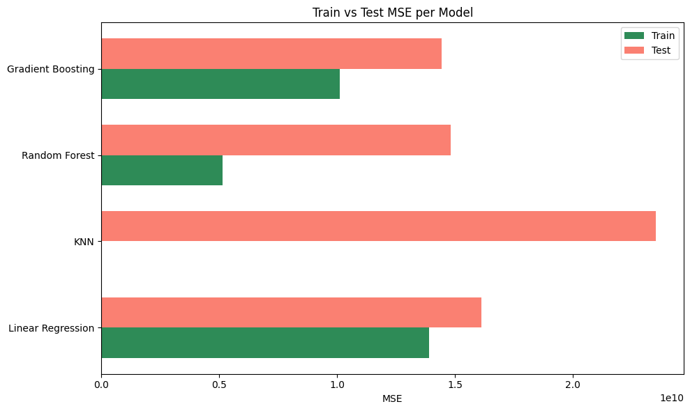

| Model             | Train MSE | Test MSE  |
|------------------|-----------|-----------|
| Linear Regression | 1.388029e+10    | 1.610842e+10   |
| Random Forest     | 5.143123e+09    | 1.480457e+10    |
| KNN               | 0.000000e+00    | 2.351729e+10    |
| Gradient Boosting | 1.009787e+1    | 1.443807e+10    |


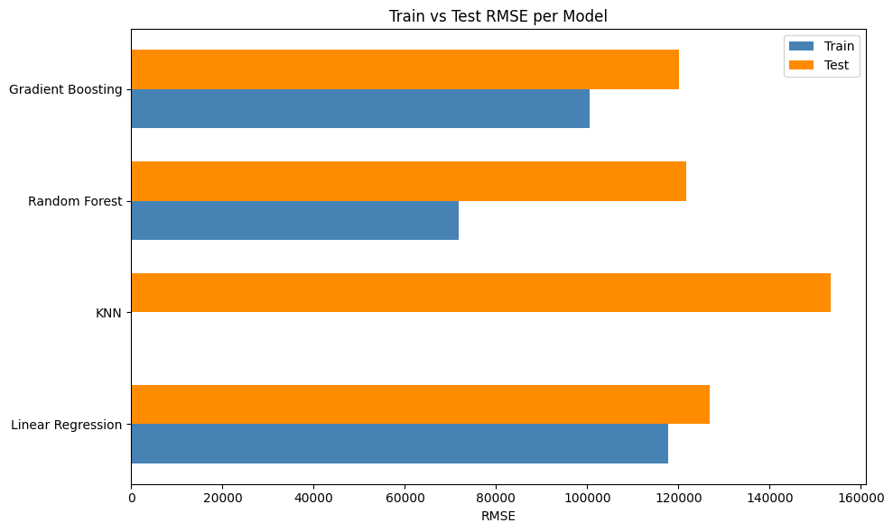
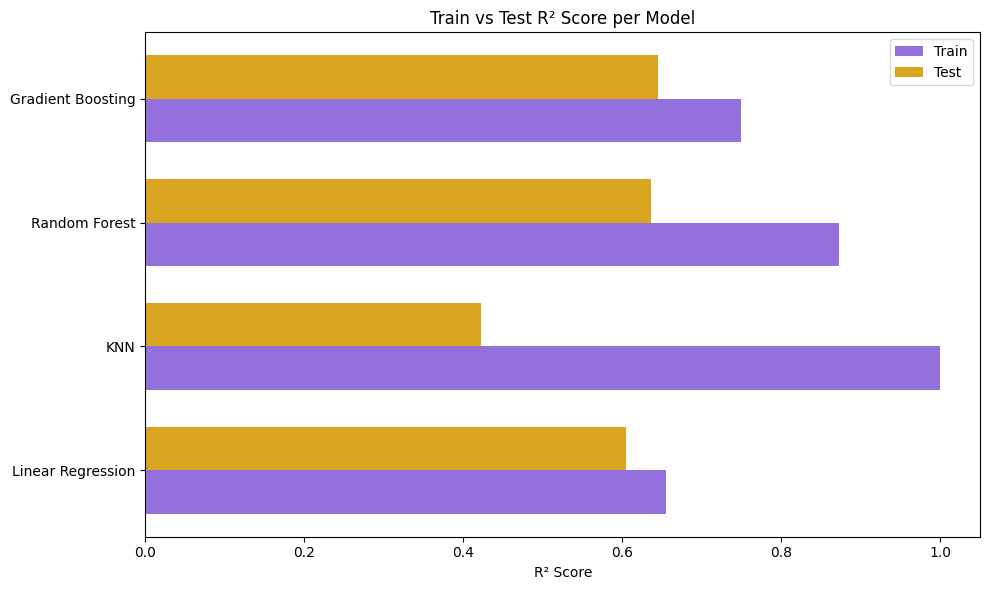

#### Tabel dan Histogram Root Mean Squared Error (RMSE) dan R-squared (R²)

| Model                 | Train RMSE | Test RMSE   | Train R²  | Test R²   |
| --------------------- | ---------- | ----------- | --------- | --------- |
| **Linear Regression** | 117,814    | 126,919     | 0.655     | 0.604     |
| **KNN Regressor**     | **0.000**  | 153,353     | **1.000** | 0.423     |
| **Random Forest**     | 71,716     | 121,674     | 0.872     | 0.636     |
| **Gradient Boosting** | 100,488    | **120,159** | 0.749     | **0.645** |

## Interpretasi Hasil
1. Linear Regression

Train RMSE dan Test RMSE cukup dekat (≈117k vs 126k), menunjukkan model ini tidak overfitting. Namun, R² hanya sekitar 0.60, artinya hanya 60% variasi target yang bisa dijelaskan. Model baseline, tidak kompleks, tapi performanya terbatas.

2. K-Nearest Neighbors (KNN)

Train RMSE = 0 dan R² = 1: indikasi overfitting ekstrim. Namun, Test RMSE tinggi (153k) dan Test R² hanya 0.42. Kesimpulannya model gagal generalisasi ke data baru.

3. Random Forest

Train RMSE = 71k, cukup rendah tetapi model belajar cukup baik. Test RMSE = 121k, ada sedikit overfitting, tapi masih bisa diterima. R² Train = 0.87, Test = 0.63 → model cukup kuat dalam menangkap hubungan antar fitur.

4. Gradient Boosting

Train RMSE = 100k, lebih besar dari Random Forest. Test RMSE paling rendah (120k) dan R² Test tertinggi (0.645). Artinya model ini menghindari overfitting, dan paling bagus di generalisasi ke data baru. Cenderung lebih halus dan presisi, cocok untuk dataset dengan noise.

### Answer Problem Statements
**1. Bagaimana cara memprediksi harga rumah berdasarkan karakteristik fisik dan lokasi properti?**

Prediksi harga rumah berhasil diimplementasikan melalui beberapa model machine learning dengan pendekatan regresi. Model-model yang digunakan adalah Linear Regression, KNN, Random Forest, dan Gradient Boosting. Berdasarkan hasil evaluasi, model KNN dan Gradient Boosting menunjukkan performa terbaik dengan nilai MSE dan RMSE terendah pada data testing, yang mengindikasikan kemampuan prediksi yang lebih akurat.
Dalam proses prediksi, karakteristik fisik seperti luas area (sqft_living), jumlah kamar tidur (bedrooms), jumlah kamar mandi (bathrooms), dan lokasi properti (waterfront, view, city) menjadi faktor penting. Fitur-fitur baru yang dibuat seperti view_sqft, waterfront_sqft, status_renovation, age, dan years_since_renovated juga berkontribusi signifikan dalam meningkatkan akurasi prediksi.

**2. Faktor-faktor apa yang paling berpengaruh terhadap harga rumah di pasar properti?**
Berdasarkan analisis feature importance dari model terbaik (Random Forest dan Gradient Boosting), faktor-faktor yang paling berpengaruh terhadap harga rumah adalah:
  - Luas area tempat tinggal (sqft_living)
  - Lokasi dengan pemandangan air (waterfront)
  - Kualitas pemandangan (view)
  - Jumlah kamar mandi (bathrooms)
  - Luas area di atas tanah (sqft_above)
  - Fitur interaksi antara view dan luas bangunan (view_sqft)
  - Umur properti (age)
  - Faktor lokasi yang ditunjukkan oleh fitur kota (city_*) juga memiliki pengaruh signifikan, dengan beberapa kota menunjukkan korelasi positif yang kuat dengan harga tinggi.


### Kesimpulan
Berdasarkan hasil evaluasi terhadap empat algoritma regresi, yaitu Linear Regression, K-Nearest Neighbors (KNN), Random Forest, dan Gradient Boosting, model yang direkomendasikan sebagai solusi terbaik adalah Gradient Boosting. Model ini menunjukkan performa paling seimbang dengan nilai R² tertinggi pada data uji sebesar 0.645, serta nilai MSE dan RMSE yang relatif rendah, menandakan kemampuan prediksi yang baik dan generalisasi yang kuat. Berbeda dengan KNN yang mengalami overfitting (R² training = 1.0, R² testing = 0.42), Gradient Boosting tetap stabil tanpa kehilangan akurasi pada data uji. Model ini juga telah ditingkatkan melalui proses hyperparameter tuning menggunakan GridSearchCV dengan kombinasi parameter terbaik n_estimators=200, max_depth=3, dan learning_rate=0.1, yang memberikan kontribusi terhadap peningkatan performa model. Dengan mempertimbangkan hasil evaluasi kuantitatif serta proses tuning yang dilakukan, Gradient Boosting dipilih sebagai model yang paling layak digunakan untuk menyelesaikan permasalahan prediksi harga dalam proyek ini.

# Referensi

1. hallan, rosalia, & Fajri, I. N. (2025). Prediksi Harga Rumah menggunakan Machine Learning Algoritma Regresi Linier. Jurnal Teknologi Dan Sistem Informasi Bisnis, 7(1), 57-62. https://doi.org/10.47233/jteksis.v7i1.1732

2. E. Fitri, “Analisis Perbandingan Metode Regresi Linier, Random Forest Regression dan Gradient Boosted Trees Regression Method untuk Prediksi Harga Rumah”, J. Appl. Comput. Sci. Technol., vol. 4, no. 1, pp. 58 - 64, Jul. 2023. https://doi.org/10.52158/jacost.v4i1.491

3. Dicoding. (n.d.). Machine Learning Terapan. https://www.dicoding.com/academies/319-machine-learning-terapan
